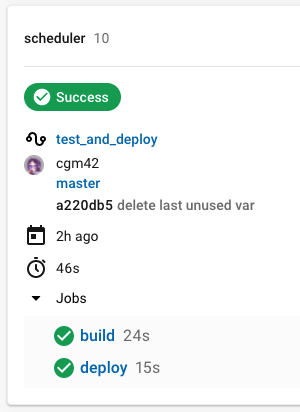

# Interview scheduler

- [About](#about)
- [Final product](#final-product)
- [Installation](#installation)
- [Usage](#usage)
- [Testing](#testing)
- [Deployment](#deployed-app)
- [Dependencies](#dependencies)
- [Development dependencies](#development-dependencies)

## About

The **Interview Scheduler** is a single page app built with [React](https://reactjs.org/). It allows users to book, edit and cancel appointments. The data is stored on a PostgreSQL database, and updated in multi-user situations through a WebSocket connection.

## Final product

---

## Installation

Install all the dependencies:

npm i

The [Interview Scheduler API](https://github.com/cgm42/scheduler-api) needs to be installed as well as a [PostgreSQL](https://www.postgresql.org/) database.

## Testing

A test-driven development apporach was adopted to ensure high test coverage and code quality.

Testing frameworks:

- Static testing with the [prop-types](https://www.npmjs.com/package/prop-types) package.
- Unit testing with [Storybook](https://storybook.js.org/).
- Unit testing and integration testing with [Jest](https://jestjs.io/) and the [Testing library](https://testing-library.com/).
- End to end testing with [Cypress](https://www.cypress.io/).

## Deployment

Deployed on Netlify and Heroku: https://scheduler-react-websocket.netlify.app/

Note Heroku server instance will shut down after thirty minutes on inactivity. It may take a few extra seconds for it to start up again.

Continuous integration, automatated testing and deployment enabled by [CircleCI](https://circleci.com/):

## Dependencies

- [React](https://reactjs.org/)
- [axios](https://www.npmjs.com/package/axios)
- [classnames](https://www.npmjs.com/package/classnames)
- [normalize](https://www.npmjs.com/package/normalize)

## Development dependencies

- [Babel](https://babeljs.io/)
- [Storybook](https://storybook.js.org/)
- [Testing library](https://testing-library.com/)
- [node-sass](https://www.npmjs.com/package/node-sass)
- [prop-types](https://www.npmjs.com/package/prop-types)
- [react-test-renderer](https://reactjs.org/docs/test-renderer.html)
